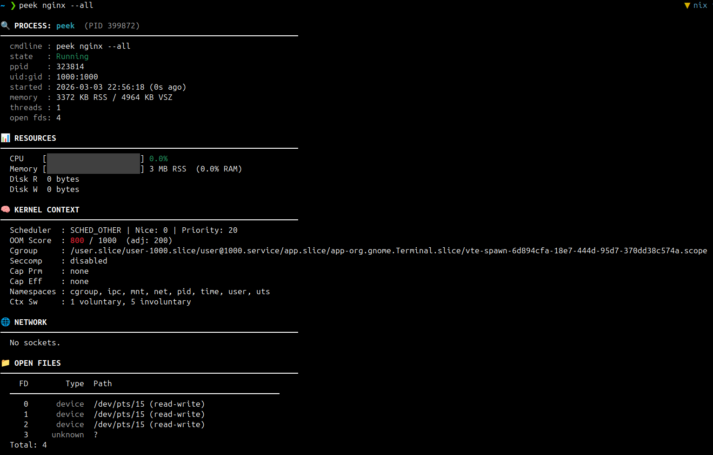
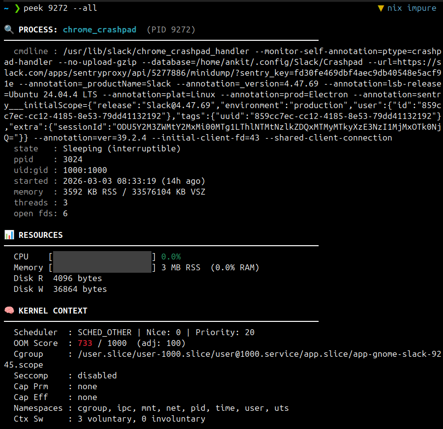
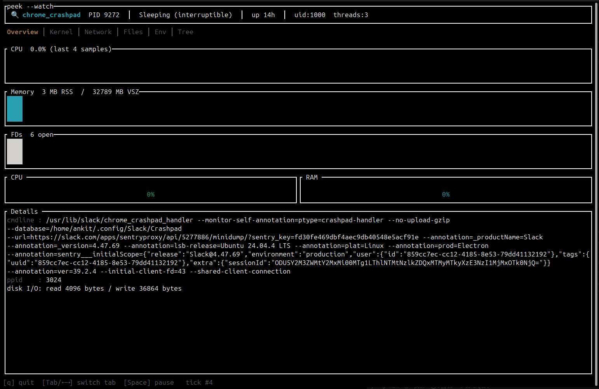
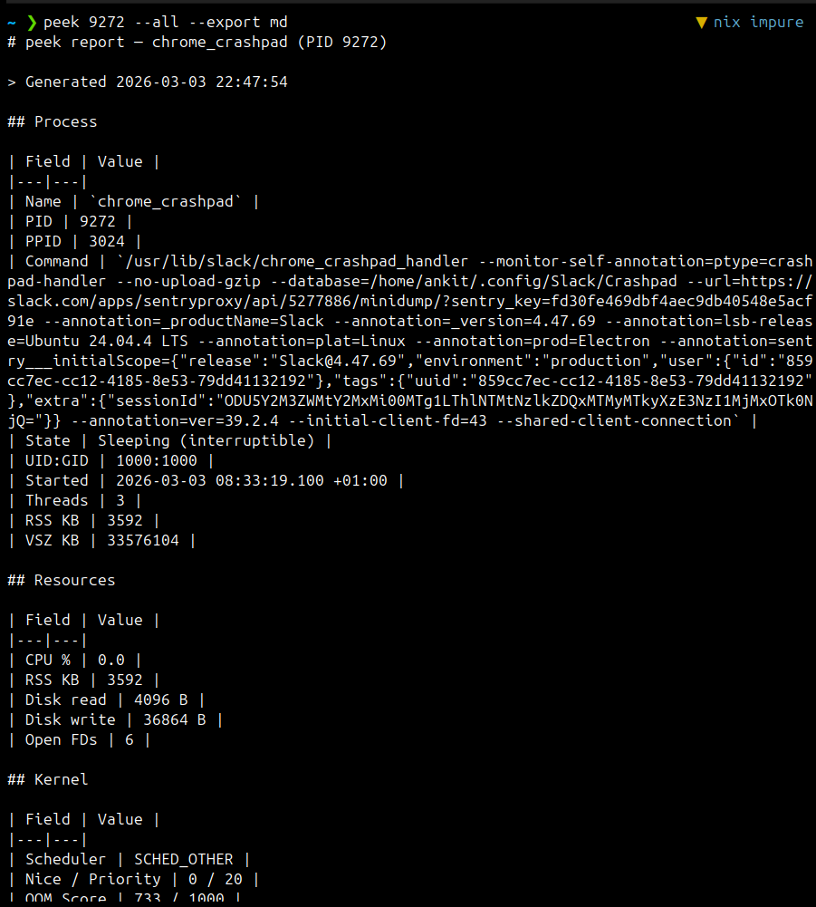
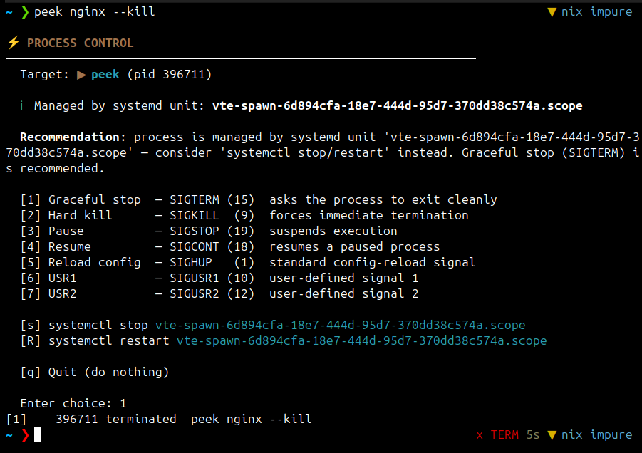

# peek

**The Process Intelligence Tool for Linux**

A single unified CLI that replaces the typical `ps + lsof + ss + /proc` workflow. Inspect any process by PID or name: see what it is, what it’s doing, how it uses resources, and what it’s connected to.

[](https://github.com/ankittk/peek/actions/workflows/ci.yml)
[](LICENSE)
[](https://www.rust-lang.org/)
[](https://crates.io/crates/peek-process)
[](https://crates.io/crates/peek-process)
[](https://github.com/ankittk/peek)
[](https://github.com/ankittk/peek/releases)
[](https://github.com/ankittk/peek/releases)
[%20%7C%20macOS%20%26%20Windows%20(preview)-lightgray.svg)](https://github.com/ankittk/peek#platform-support)
[](https://github.com/ankittk/peek/discussions)

---

**Overview**



**Identity & resources**



**Live TUI (`--watch`)**



**Export (MD / HTML / PDF)**



**Signal / kill panel**



---

**Questions or ideas?** Use [GitHub Discussions](https://github.com/ankittk/peek/discussions) so the issue tracker stays focused on bugs and features.

---

## Comparison with other tools

| | **peek** | **htop** | **glances** | **top** | **procs** |
|---|----------|----------|-------------|--------|----------|
| **Focus** | Single-process deep dive | System-wide process list | System-wide dashboard | Process list | System-wide process list |
| **Language** | Rust | C | Python | C | Rust |
| **Output** | One process: identity, resources, network, files, env, kernel, tree | Scrolling list, per-process stats | Multi-panel TUI, plugins | List + header | Rich process list with tree view |
| **Network per process** | Listening TCP/UDP/Unix, connections, traffic rate, optional reverse DNS | No | Per-interface only | No | No |
| **Open files / env** | Yes, with secret redaction | No | No | No | No |
| **Kill / signals** | Yes, with impact analysis and systemd awareness | Yes (basic) | Limited | Yes (basic) | Yes (basic) |
| **Export** | JSON, Markdown, HTML, PDF | No | CSV/JSON/APIs | No | No |
| **Daemon / history** | Yes (`peekd`) — ring buffer, alerts, IPC | No | Client/server, Web UI | No | No |
| **Single binary** | Yes, static build | No (ncurses) | No (Python + deps) | No | Yes |

**When to use peek:** You have a PID or process name and want one place to understand it (what binary, state, OOM risk, open sockets, env, files) and optionally act on it (signals, export report). For system-wide process lists, use htop or top; for a rich system dashboard, use glances.

---

**Why peek?** It’s a single, focused tool for deeply understanding one process at a time — with explanations of kernel state, OOM risk, capabilities, network, files, and environment. Instead of juggling `ps`, `lsof`, `ss`, `/proc`, and ad‑hoc scripts, you get one consistent CLI and TUI, plus exportable reports for debugging and sharing.

## Summary

- **Single process view** — Identity, resources, network, open files, environment, kernel context, process tree.
- **Human-readable** — Kernel state, scheduler, OOM score, capabilities, current syscall, and well-known binary descriptions (e.g. nginx, postgres, systemd).
- **Network** — Listening TCP/UDP/Unix, established connections, traffic rate (RX/TX), optional reverse DNS.
- **Safe controls** — Signal/kill panel with impact analysis; systemd unit detection and `systemctl` suggestions.
- **Scriptable** — `--json` and `--json-snapshot` for automation; export to Markdown, HTML, PDF.
- **Optional daemon** — `peekd` for history, alerting, and persistent monitoring over a Unix socket.

---

## Quick start

```bash
# Inspect by PID or name
peek 1234
peek nginx

# Full picture (resources, kernel, network, files, env, tree)
peek nginx --all

# Live-updating TUI
peek nginx --all --watch

# Kill / signal panel (with impact analysis)
peek nginx --kill

# JSON for scripting
peek 1234 --json
peek 1234 --json-snapshot   # includes captured_at, peek_version, process
```

### Example: peek nginx (trimmed)

```text
🔍 PROCESS: nginx (PID 1234)
────────────────────────────────────────
  cmdline : nginx: worker process
  exe     : /usr/sbin/nginx
  state   : Running
  ppid    : 1
  uid:gid : 33:33
  started : 2026-03-03 12:34:56 (5m ago)
  memory  : 123456 KB RSS / 987654 KB VSZ
  threads : 12
  open fds: 128

📊 RESOURCES
────────────────────────────────────────
  CPU    [██████░░░░░░░░░░░░] 42.3%
  Memory [█████░░░░░░░░░░░░░] 120.5 MB RSS  (12.3% RAM)

🧠 KERNEL CONTEXT
────────────────────────────────────────
  Scheduler  : CFS (Normal time-sharing scheduler)
  OOM Score  : 320 / 1000  (Moderate kill likelihood)
  Cgroup     : /system.slice/nginx.service
  Seccomp    : filter active
  Namespaces : pid, net, mnt, uts, ipc

🌐 NETWORK
────────────────────────────────────────
  ▶ Listening (TCP): tcp 0.0.0.0:80, tcp [::]:80
  ▶ Connections (3): tcp 10.0.0.5:80 → 203.0.113.10:54321 [ESTABLISHED]
```

---

## Usage

### Basic inspection

```bash
peek <PID>              # by PID
peek <name>             # by process name (first match)
peek 1234 --all         # all sections: resources, kernel, network, files, env, tree, GPU
```

### Sections (flags)

| Flag | Description |
|------|-------------|
| `-r` / `--resources` | CPU, memory (RSS/PSS/swap), disk I/O, FD count |
| `-k` / `--kernel` | Scheduler, OOM score, cgroup, namespaces, seccomp, capabilities, current syscall |
| `-n` / `--network` | Listening TCP/UDP, Unix sockets, connections, traffic rate (1s sample) |
| `-f` / `--files` | Open file descriptors with type and path |
| `-e` / `--env` | Environment variables (secrets redacted) |
| `-t` / `--tree` | Process tree (ancestors and children) |
| `-a` / `--all` | All of the above |

### Live TUI and export

```bash
peek 1234 --all --watch [INTERVAL_MS]   # TUI with sparklines; default 2000 ms
peek 1234 --export md                   # Markdown
peek 1234 --export html                  # Standalone HTML
peek 1234 --export pdf                   # PDF (needs wkhtmltopdf, weasyprint, or Chromium)
```

### Port search and kill panel

```bash
peek --port 443              # find processes using port 443 (TCP/UDP)
peek nginx --kill             # interactive signal/kill panel with impact analysis
peek nginx --kill --sudo      # re-exec with sudo for root-owned processes
```

### History and alerts (requires `peekd`)

```bash
peekd &                      # start daemon (or use systemd unit)
peek 1234 --history          # show resource history for PID
peek --alert-list            # list alert rules
# Add/remove rules via CLI or config file (see [docs/architecture.md](docs/architecture.md))
```

See `man peek` (or `peek --help`) for all options.

---

## Installation

**One-line install (Linux, from GitHub Releases):**

```bash
curl -sSL https://raw.githubusercontent.com/ankittk/peek/main/install.sh | sudo bash
```

This installs `peek` and `peekd` to `/usr/local/bin` and can optionally install the systemd unit so `sudo systemctl start peekd` works. Set `PEEK_INSTALL_DIR` or `PEEK_VERSION` if needed. See [packaging/](packaging/) for systemd unit, .deb, .rpm, and AUR.

### Prerequisites

- **From source:** Rust toolchain (stable). Install from [rustup.rs](https://rustup.rs).
- **PDF export (optional):** One of: `wkhtmltopdf`, `weasyprint`, or Chromium/Chrome.
- **MSRV:** Rust 1.79+ (driven by `ratatui` and other dependencies).

### GNU/Linux

#### Debian / Ubuntu

**From GitHub Releases (.deb):** Each release includes `.deb` packages (version 1.0, 1.1, etc.) for amd64 and arm64. Download `peek_1.0_amd64.deb` and `peekd_1.0_amd64.deb` (or `_arm64.deb` on ARM) from the [Releases](https://github.com/ankittk/peek/releases) page, then:

```bash
# Install peek first (peekd depends on it), then peekd
sudo dpkg -i peek_*_amd64.deb peekd_*_amd64.deb
sudo systemctl daemon-reload && sudo systemctl start peekd   # optional
```

When packages are in a PPA or distro repos: `sudo apt update && sudo apt install peek peekd`.

From source:

```bash
sudo apt install build-essential pkg-config libssl-dev   # typical build deps
cargo build --release -p peek-process -p peekd
sudo cp target/release/peek target/release/peekd /usr/local/bin/
```

#### Fedora / RHEL / CentOS

**From GitHub Releases (.rpm):** Releases include `.rpm` packages for x86_64. Download the `peek-process-*.rpm` and `peekd-*.rpm` from the [Releases](https://github.com/ankittk/peek/releases) page, then:

```bash
sudo rpm -ivh peek-process-*.rpm peekd-*.rpm
# or: sudo dnf install ./peek-process-*.rpm ./peekd-*.rpm
sudo systemctl start peekd   # optional
```

When RPM is in Fedora/EPEL: `sudo dnf install peek peekd`.

From source:

```bash
sudo dnf install gcc pkg-config openssl-devel
cargo build --release -p peek-process -p peekd
sudo cp target/release/peek target/release/peekd /usr/local/bin/
```

#### Arch Linux

```bash
# AUR (when published):
yay -S peek peekd
# or
paru -S peek peekd
```

From source or [packaging/PKGBUILD](packaging/PKGBUILD):

```bash
sudo pacman -S base-devel
cargo build --release -p peek-process -p peekd
sudo cp target/release/peek target/release/peekd /usr/local/bin/
```

#### Other Linux (generic)

Download the static binary for your architecture from [GitHub Releases](https://github.com/ankittk/peek/releases) and put `peek` and `peekd` in your `PATH` (e.g. `~/.local/bin` or `/usr/local/bin`).

```bash
# Example for x86_64 Linux (musl static): set TAG e.g. TAG=v1.0.0 (release tag). Asset names use v1.0 for 1.0.x.
TAG=v1.0.0
VERSION_LABEL=v1.0
curl -sSL -o peek "https://github.com/ankittk/peek/releases/download/${TAG}/peek-${VERSION_LABEL}-x86_64-linux-musl"
curl -sSL -o peekd "https://github.com/ankittk/peek/releases/download/${TAG}/peekd-${VERSION_LABEL}-x86_64-linux-musl"
chmod +x peek peekd
```

### macOS

```bash
# Homebrew (when formula is published)
brew install peek
```

From source:

```bash
brew install rust
git clone https://github.com/ankittk/peek.git && cd peek
cargo build --release -p peek-process
cp target/release/peek /usr/local/bin/
```

**Note:** macOS is **preview only**. You get basic process info (PID, name, memory, CPU, exe, state) and TUI/export. Kernel, network, open files, env, tree, and `peekd` require Linux.

### Windows

From source only:

```bash
# Install Rust from https://rustup.rs, then:
git clone https://github.com/ankittk/peek.git && cd peek
cargo build --release -p peek-process
# Binary: target\release\peek.exe
```

**Note:** Windows is **preview only**. You get baseline process info and TUI/export. `peekd` is not supported; the daemon binary exits with a message.

### Cargo (all platforms)

```bash
cargo install peek-process
# Optional (Linux/Unix only):
cargo install peekd
```

This installs `peek` (and optionally `peekd`) into `~/.cargo/bin`. Ensure that directory is on your `PATH`.

---

## Build from source

```bash
git clone https://github.com/ankittk/peek.git
cd peek
cargo build --release --workspace
```

- **Release binaries:** `target/release/peek`, `target/release/peekd` (Linux/Unix).
- **Static build (Linux):** `cargo build --release --target x86_64-unknown-linux-musl` (or `aarch64-unknown-linux-musl` for ARM). Release assets are named `peek-v1.0-x86_64-linux-musl`, `peekd-v1.0-aarch64-linux-musl`, etc. (version label is major.minor, e.g. v1.0 for 1.0.x).

### Optional build-time features

- No optional features are required for core behavior. GPU detection uses runtime checks (nvidia-smi, AMD sysfs).

---

## Runtime dependencies

| Dependency | When needed |
|------------|-------------|
| **None** | Basic process info, TUI, JSON/MD/HTML export |
| **wkhtmltopdf** or **weasyprint** or **Chromium** | `--export pdf` |
| **peekd** (daemon) | `--history`, alert rules |

---

## Platform support

**Linux is the primary target** with full features. **macOS and Windows are preview (best-effort)** and only support a subset: PID, name, CPU, memory, exe, state, and the TUI/export shell. Kernel, network, open files, env, tree, and peekd are Linux-only. The table below is the source of truth.

| Feature | Linux | macOS | Windows |
|--------|-------|-------|--------|
| Process identity, memory, CPU, exe | ✅ Full | ✅ Basic | ✅ Basic |
| Kernel (cgroups, OOM, namespaces, seccomp, caps) | ✅ | — | — |
| Network (TCP/UDP/Unix, traffic rate, reverse DNS) | ✅ | — | — |
| Open files, env (with redaction), process tree | ✅ | — | — |
| GPU (NVIDIA/AMD) | ✅ | — | — |
| Port search, kill/signal panel | ✅ | — | — |
| peekd (history, alerts) | ✅ | — | — |
| TUI, export (JSON/MD/HTML/PDF) | ✅ | ✅ (preview) | ✅ (preview) |

---

## Project layout

| Path | Description |
|------|-------------|
| `crates/peek-cli` | CLI and TUI binary `peek` (crate name: `peek-process`) |
| `crates/peek-core` | Core library: `ProcessInfo`, `collect()`, `collect_extended()` |
| `crates/peekd` | Daemon for history and alerts (Unix socket) |
| `crates/proc-reader` | `/proc/<PID>/*` and sysfs parsing |
| `crates/kernel-explainer` | Raw kernel values |
| `crates/resource-sampler` | CPU, memory, disk I/O, GPU, ring buffer |
| `crates/network-inspector` | TCP/UDP/Unix sockets, reverse DNS |
| `crates/signal-engine` | Signal impact analysis, systemd detection |
| `crates/export-engine` | JSON, Markdown, HTML, PDF |
| `packaging/` | systemd unit, RPM/Debian/Arch packaging |
| `docs/` | Extended docs: architecture, peekd, scripting, FAQ |

---

## Documentation

- **Questions and community:** [GitHub Discussions](https://github.com/ankittk/peek/discussions)
- **Architecture and peekd IPC:** [docs/architecture.md](docs/architecture.md)
- **Daemon and alerts:** [docs/peekd.md](docs/peekd.md)
- **Scripting and automation:** [docs/scripting.md](docs/scripting.md)
- **FAQ:** [docs/faq.md](docs/faq.md)
- **Contributing:** [CONTRIBUTING.md](CONTRIBUTING.md)
- **Security:** [SECURITY.md](SECURITY.md)
- **Code of conduct:** [CODE_OF_CONDUCT.md](CODE_OF_CONDUCT.md)

---

## License

MIT License. See [LICENSE](LICENSE).
